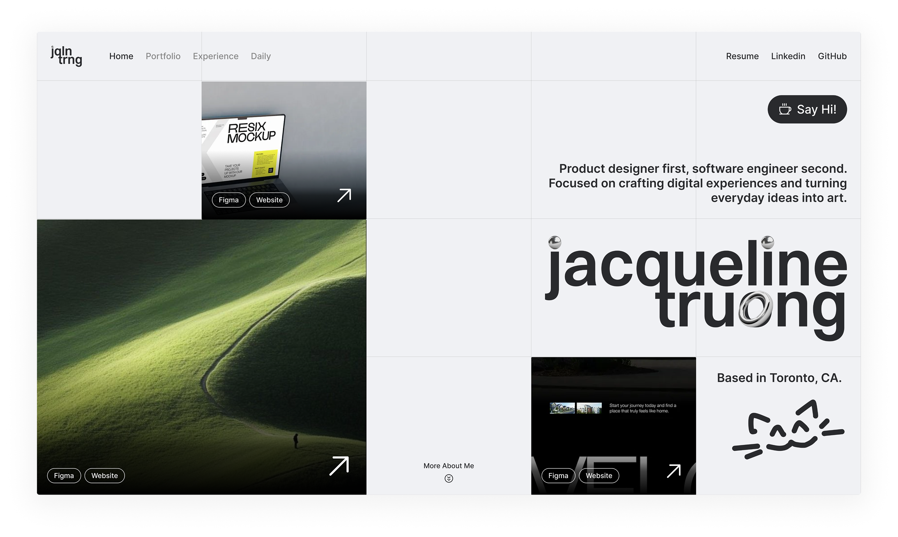

  

<h1 align="center">
  jacquelinetruong's portfolio
</h1>

  a collection of my ideas — blending design, development, and thoughtful digital experiences.

  🔗
  <a href="https://www.jacquelinetruong.dev/" target="_blank">
    jacquelinetruong.dev
  </a>

  

## tech stack

- **languages:** TypeScript, HTML, CSS / Tailwind CSS
- **frameworks/libraries:** React, Next.js, Framer Motion, Lenis, Notion API
- **CMS:** Notion
- **deployment:** Vercel
- **design:** Figma

## let's chat!

if you'd like to chat or collaborate, feel free to reach out :)

💌 hello@jacquelinetruong.dev

#

© 2026 built & designed by jacqueline truong
